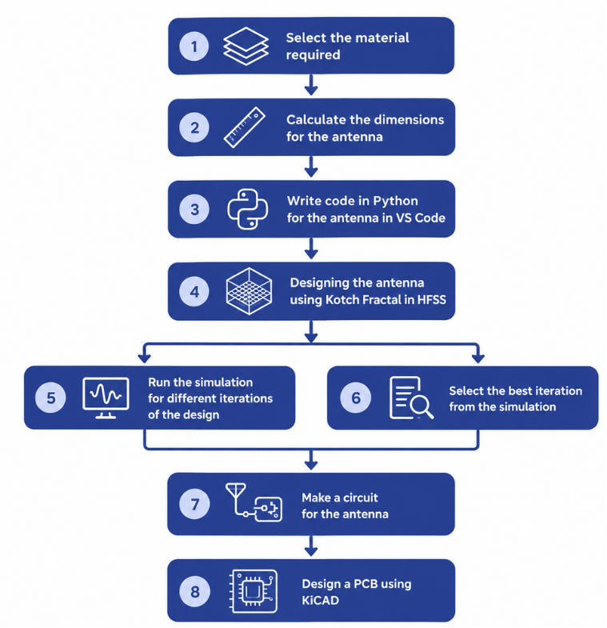

# HYConA- Helmet Yield Conformal Antenna
SIH26185 | Team ID 133214

An antenna design and electromagnetic simulation repository focused on a helmet-mounted conformal antenna concept for tactical communication systems.

## Overview
The "HYConA" project proposes a helmet-mounted conformal antenna for tactical communications in urban CQB environments, replacing vulnerable, protruding whip antennas. Elevated to the commando's helmet, the ultra-thin, flexible microstrip patch antenna uses Koch Fractal Design to support dual UHF and L-band frequencies while incorporating an advanced RF shielding layer. Developed using Python, Ansys HFSS, and KiCAD, the system interfaces with existing tactical radios and body-worn cameras. It addresses key challenges like bending gain loss and SAR trade-offs through electromagnetic bandgap shielding, enhancing real-time coordination while supporting India's defense indigenization.

---

## Technology Stack

| Component | Technology |
|-----------|-----------|
| **Language** | Python 3.x |
| **Simulation Software** | Ansys HFSS |
| **PCB Design** | KiCad |
| **Version Controll** | GitHub |
| **Source-Code Editor** | VS Code |
---

## Methodology

---
  
## Contributors

| [ <b>Priyasmita Garanayak</b>](https://github.com/prezzz-63) | [ <b>Sai Prasad Padhy</b>](https://github.com/tsylatac37) | [ <b>Ganti Tejaswini</b>](https://github.com/G08Tejaswini) | [ <b>Gorthi Sai Satwik</b>](https://github.com/cain-ux) | [ <b>Sri Prajna</b>](https://github.com/sriprajnaA) | [ <b>Shantanu Kumar</b>](https://github.com/shantanuk8707-afk) |
| :---: | :---: | :---: | :---: | :--: | :--: |
---
